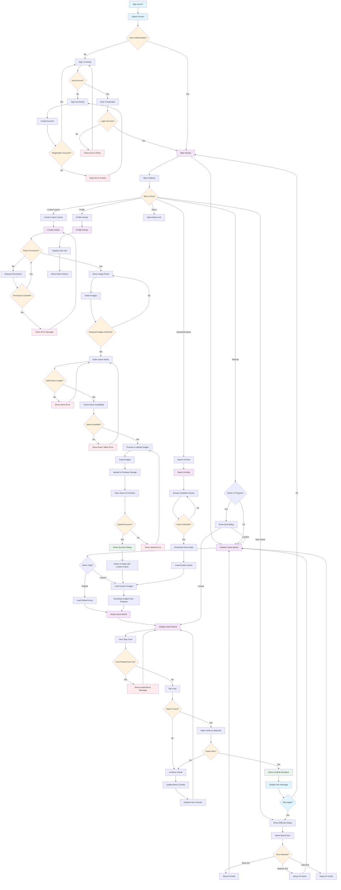

# Memory Game (Memory Exe) 🧠🎮

A modern Android memory game built with Kotlin that challenges players to match pairs of cards. The app features custom game creation, Firebase integration, and multiple difficulty levels.

## 📱 Features

### Core Gameplay
- **Three Difficulty Levels**: Easy (4x2), Medium (6x3), Hard (6x4)
- **Interactive Memory Matching**: Flip cards to find matching pairs
- **Progress Tracking**: Real-time move counter and pairs found display
- **Win Celebration**: Confetti animation upon game completion

### Custom Game Creation
- **Photo Integration**: Create custom games using device photos
- **Image Upload**: Upload custom images to Firebase Storage
- **Game Sharing**: Share custom games with other players
- **Image Optimization**: Automatic image scaling and compression

### Firebase Integration
- **User Authentication**: Sign up/Sign in with email and password
- **Cloud Storage**: Store custom game images in Firebase Storage
- **Firestore Database**: Save game data and user-generated content
- **Remote Config**: Dynamic app configuration
- **Analytics**: Track user engagement and game events

### User Experience
- **Splash Screen**: Branded app introduction
- **Profile Management**: User profile and game history
- **Search & Download**: Browse and download community-created games
- **Responsive Design**: Optimized for different screen sizes

## 🛠️ Technology Stack

- **Language**: Kotlin
- **Platform**: Android (API 24+)
- **Architecture**: MVVM pattern
- **UI Framework**: Android Views with ViewBinding
- **Backend**: Firebase Suite
  - Authentication
  - Firestore Database
  - Storage
  - Remote Config
  - Analytics
- **Image Loading**: Picasso
- **Animations**: Confetti library
- **Build System**: Gradle with Kotlin DSL

## 📋 Prerequisites

- Android Studio Arctic Fox or later
- Android SDK API 24 or higher
- Google Services JSON file configured
- Firebase project setup

## 🚀 Getting Started

### 1. Clone the Repository
```bash
git clone https://github.com/yourusername/memory-exe.git
cd memory-exe
```

### 2. Firebase Setup
1. Create a new Firebase project at [Firebase Console](https://console.firebase.google.com/)
2. Add an Android app to your Firebase project
3. Download the `google-services.json` file
4. Place it in the `app/` directory
5. Enable the following Firebase services:
   - Authentication (Email/Password)
   - Firestore Database
   - Storage
   - Remote Config
   - Analytics

### 3. Configure Firebase Services

#### Firestore Security Rules
```javascript
rules_version = '2';
service cloud.firestore {
  match /databases/{database}/documents {
    match /games/{gameId} {
      allow read, write: if request.auth != null;
    }
  }
}
```

#### Storage Security Rules
```javascript
rules_version = '2';
service firebase.storage {
  match /b/{bucket}/o {
    match /images/{allPaths=**} {
      allow read, write: if request.auth != null;
    }
  }
}
```

### 4. Build and Run
1. Open the project in Android Studio
2. Sync the project with Gradle files
3. Connect an Android device or start an emulator
4. Click Run or use `./gradlew installDebug`

## 📁 Project Structure

```
app/src/main/java/com/example/memoryexe/
├── models/
│   ├── BoardSize.kt          # Game board size configurations
│   ├── MemoryCard.kt         # Card data model
│   ├── MemoryGame.kt         # Game logic and state management
│   ├── MemoryGameName.kt     # Game name data model
│   └── UserImageList.kt      # Custom game images model
├── utils/
│   ├── BitmapScaler.kt       # Image scaling utilities
│   ├── Constants.kt          # App constants and default icons
│   └── PermissionUtils.kt    # Runtime permission helpers
├── CreateActivity.kt         # Custom game creation screen
├── HomeActivity.kt           # Home/Dashboard screen
├── MainActivity.kt           # Main game screen
├── ProfileActivity.kt        # User profile screen
├── SearchActivity.kt         # Game search and download
├── SignInActivity.kt         # User authentication
├── SignUpActivity.kt         # User registration
├── SplashScreen.kt          # App splash screen
├── ImagePickerAdapter.kt     # Image selection adapter
└── MemoryBoardAdapter.kt    # Game board adapter
```

## 🎮 How to Play

1. **Sign Up/Sign In**: Create an account or sign in to access the game
2. **Choose Difficulty**: Select Easy (8 cards), Medium (18 cards), or Hard (24 cards)
3. **Start Playing**: Tap cards to flip them and find matching pairs
4. **Win the Game**: Match all pairs to complete the level
5. **Create Custom Games**: Use your own photos to create personalized memory games
6. **Share & Download**: Share your creations and download games from other players

## 🔄 App Workflow

The following diagram illustrates the complete user journey and app flow:



## 🔧 Key Components

### Game Logic (`MemoryGame.kt`)
- Manages card state and game progression
- Handles card flipping logic with three-state system:
  - 0 cards flipped: Restore previous cards and flip selected
  - 1 card flipped: Check for match with new selection
  - 2 cards flipped: Reset and start new selection
- Tracks moves and matched pairs
- Determines win conditions

### Firebase Integration
- **Authentication**: Secure user login/registration with email/password
- **Firestore**: Stores custom game metadata and user data
- **Storage**: Hosts user-uploaded images with automatic scaling
- **Remote Config**: Dynamic configuration for app settings
- **Analytics**: Tracks user engagement and gameplay events

### Custom Game Creation Process
1. **Permission Check**: Verify photo access permissions
2. **Image Selection**: Multi-select interface for choosing photos
3. **Image Processing**: Automatic scaling to 250px height and JPEG compression
4. **Name Validation**: Check game name availability in Firestore
5. **Cloud Upload**: Sequential upload of processed images to Firebase Storage
6. **Metadata Save**: Store game configuration in Firestore
7. **Game Launch**: Load newly created custom game

### Memory Management
- **Image Caching**: Picasso handles efficient image loading and caching
- **Bitmap Scaling**: Custom utility for memory-efficient image processing
- **Resource Cleanup**: Proper lifecycle management for activities

## 🎨 UI/UX Features

- **Material Design**: Modern Android design principles with consistent theming
- **Responsive Layout**: GridLayoutManager adapts to different board sizes
- **Smooth Animations**: Card flip animations and progress transitions
- **Progress Indicators**: Visual feedback during image uploads and downloads
- **Error Handling**: User-friendly error messages with retry options
- **Accessibility**: Proper content descriptions and focus handling

## 📱 Permissions

The app requires the following permissions:
- `READ_MEDIA_IMAGES` (API 33+) / `READ_EXTERNAL_STORAGE` (API < 33): Access device photos for custom games
- `INTERNET`: Network access for Firebase services

## 🚀 Future Enhancements

- [ ] **Multiplayer Support**: Real-time multiplayer games using Firebase Realtime Database
- [ ] **Leaderboards**: Global and friends leaderboards with best times
- [ ] **Achievement System**: Unlock achievements for various milestones
- [ ] **Additional Game Modes**: Time trials, daily challenges
- [ ] **Social Features**: Rate and comment on custom games
- [ ] **Offline Mode**: Download games for offline play
- [ ] **Advanced Statistics**: Detailed gameplay analytics dashboard
- [ ] **Accessibility Improvements**: Voice-over support and high contrast themes
- [ ] **Tablet Optimization**: Enhanced UI for larger screens

## 🤝 Contributing

We welcome contributions! Please follow these steps:

1. Fork the repository
2. Create your feature branch (`git checkout -b feature/AmazingFeature`)
3. Commit your changes (`git commit -m 'Add some AmazingFeature'`)
4. Push to the branch (`git push origin feature/AmazingFeature`)
5. Open a Pull Request

### Development Guidelines
- Follow Kotlin coding conventions
- Add unit tests for new features
- Update documentation as needed
- Ensure Firebase security rules are properly configured

## 📄 License

This project is licensed under the MIT License - see the [LICENSE](LICENSE) file for details.

## 🙏 Acknowledgments

- **Firebase**: Comprehensive backend services and infrastructure
- **Picasso**: Efficient image loading and caching library
- **Confetti**: Delightful celebration animations
- **Material Design**: Google's design system for consistent UI/UX
- **Android Jetpack**: Modern Android development components and best practices

## 📞 Support

If you encounter any issues or have questions:
- 🐛 **Bug Reports**: Create an issue on GitHub with detailed reproduction steps
- 💡 **Feature Requests**: Open a discussion to propose new features
- 📧 **Contact**: [ankit.singh4x@gmail.com]
- 📖 **Documentation**: Check the wiki for additional guides

## 🌟 Show Your Support

Give a ⭐️ if this project helped you learn Android development with Firebase!

---

**Made with ❤️ for the Android development community**
